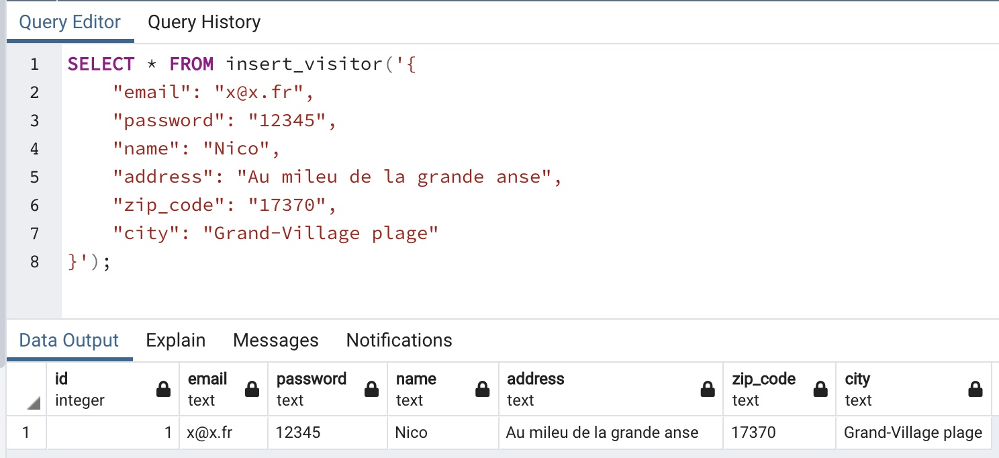
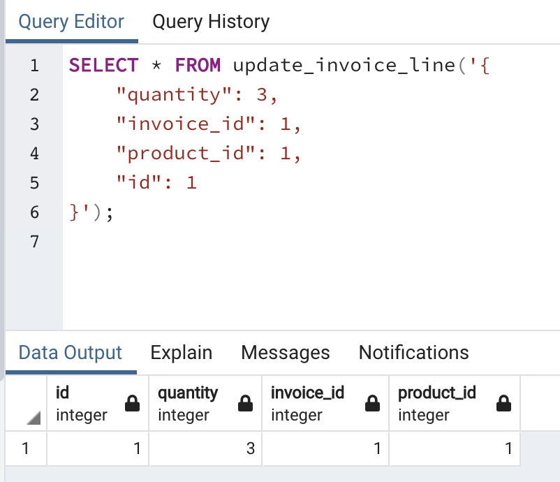
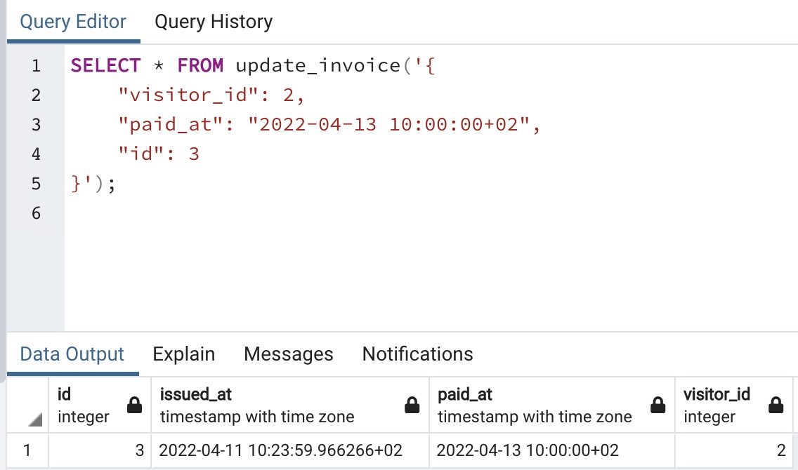
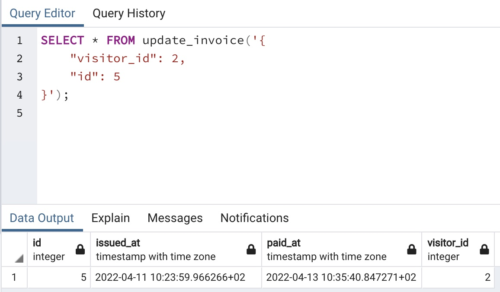
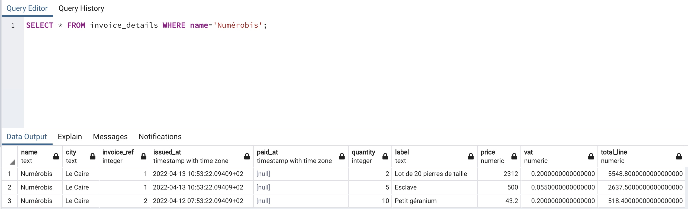
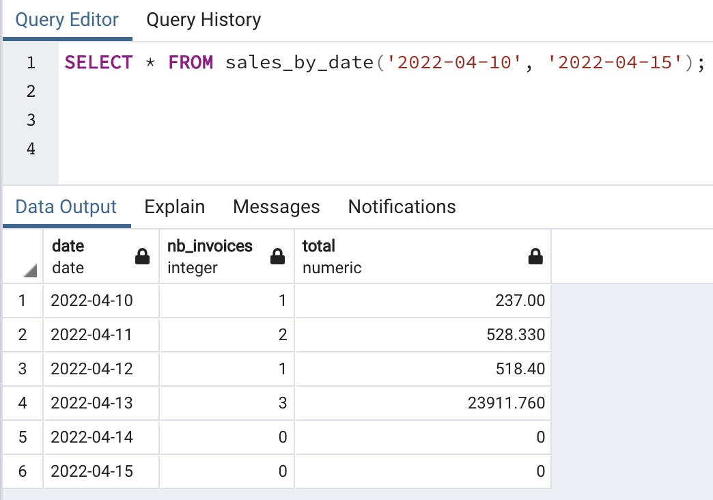
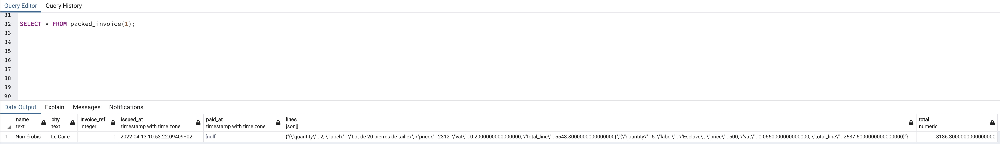
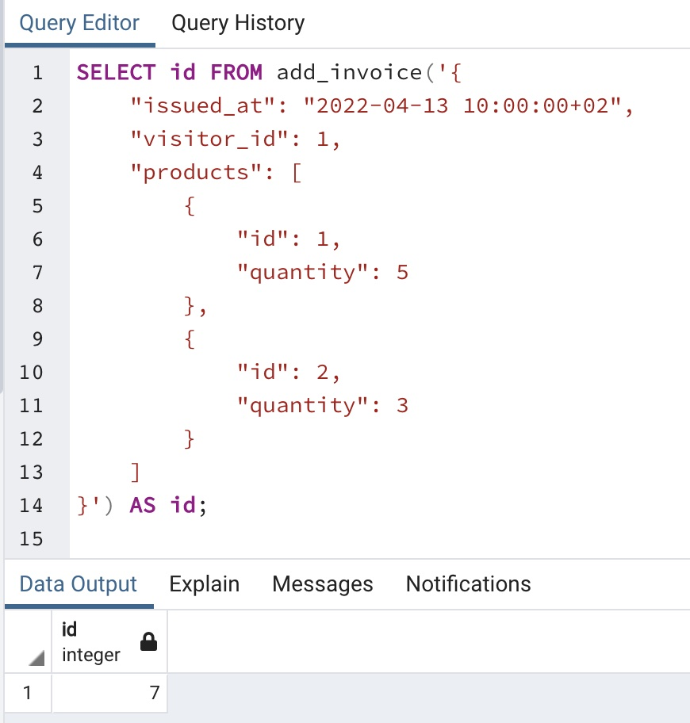
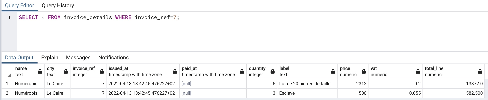

# oFact

## 1 - Création de la BDD

Créez une base de données appelée `ofact`.

Initialisez un projet Sqitch utilisant :

- postgres comme base de données
- un dossier migrations pour stocker les fichiers
- une cible par défaut pour les opérations de deploy, revert et verify

## 2 - 1ère migration

Créez une migration appelée `init`

- deploy : doit contenir les requêtes de création des tables en fonction du MCD fourni
- revert : doit supprimer les tables du deploy, attention à l'ordre
- verify : doit tester l'existence des tables en BDD

Tips :

- le script de seeding fourni doit pouvoir être exécuté sans modification
- vous trouverez tous les noms de champs dans ce script
- ajoutez tous les checks et domains que vous jugerez nécessaires
- essayez d'anticiper les requêtes les plus fréquentes pour eventuellement ajouter des index

## 3 - 3ème forme normale

Le MCD actuel ne respecte pas la 3ème forme normale

### Kézaco ???

> Les attributs d’une relation sont divisés en deux groupes : le premier groupe est composé de l'identifiant (un ou plusieurs attributs). Le deuxième groupe est composé des autres attributs (éventuellement vide). La troisième forme normale stipule que tout attribut du deuxième groupe ne peut pas dépendre d’un sous-ensemble (strict et excluant l’attribut considéré) d’autres attribut(s) du second groupe. En d’autres termes : « Un attribut non identifiant ne dépend pas d’un ou plusieurs attributs ne participant pas à l'identifiant ». Dit encore autrement : « Tous les attributs non identifiants doivent dépendre directement de l'identifiant, au sens où il n’y a aucun attribut non identifiant dépendant de l'identifiant par dépendances transitives par l’intermédiaire d’autres attributs non identifiants».

[Article wikipédia](https://fr.wikipedia.org/wiki/Forme_normale_(bases_de_donn%C3%A9es_relationnelles)#3FN_%E2%80%93_Troisi%C3%A8me_forme_normale)

OK j'avoue ... c'est pas limpide expliqué comme ça ...  
Traduction en français : des champs qui ne font pas partie de la clé primaire ne doivent pas être interdépendants  
Encore plus concrètement : quand on veut mettre à jour une info dans une table, on ne devrait avoir à mettre à jour qu'un seul champ

- Essayez de trouver la faille dans le MCD actuel et corrigez-la
- Reportez cette modification dans la structure de la BDD avec une nouvelle migration appelée `3fn`
- Attention : vous ne devez pas perdre de data lors du deploy (ou du revert) de cette migration (va falloir une goutte de DML dans les scripts ...)
- pour vous simplifier la vie par la suite, créez un nouveau script de seeding (en dupliquant le 1er) pour reflêter cette modification

## 4 - API SQL

Créez une nouvelle migration `crud_functions` et placez-y les requêtes pour insérer ou mettre à jour les entités

- nommez vos fonctions `insert_<entité>` ou `update_<entité>`
- chaque fonction doit retourner un enregistrement complet
- chaque fonction reçoit un unique paramètre de type JSON

### Exemple

```sql
SELECT * FROM insert_visitor('{
    "email": "x@x.fr",
    "password": "12345",
    "name": "Nico",
    "address": "Au mileu de la grande anse",
    "zip_code": "17370",
    "city": "Grand-Village plage"
}')
```

Résultat attendu (ne tenez pas compte des valeurs, uniquement du format du résultat) :



```sql
SELECT * FROM update_invoice_line('{
    "quantity": 3,
    "invoice_id": 1,
    "product_id": 1,
    "id": 1
}');
```

Résultat attendu :



### Pour que ça pique un peu 😈🌵

Pour la mise à jour d'une facture, faites en sorte de pouvoir omettre la date de paiement dans le json  
Si la propriété n'est pas présente, renseignez le champ avec la date et l'heure du moment

```sql
SELECT * FROM update_invoice('{
    "visitor_id": 2,
    "paid_at": "2022-04-13 10:00:00+02",
    "id": 3
}');
```

Résiltat attendu :


```sql
SELECT * FROM update_invoice('{
    "visitor_id": 2,
    "id": 5
}');
```

Résultat attendu :


Tip : Pour switcher entre une valeur fournie et une valeur par défaut, jetez un oeil [ici](https://docs.postgresql.fr/12/functions-conditional.html#FUNCTIONS-COALESCE-NVL-IFNULL), ça devrait vous inspirer 😉

## 5 - Jointures

Créez une nouvelle migration `invoice_details`.

Créez une vue détaillée des factures appelée `invoice_details`.

Cette vue doit afficher :

- le nom du visiteur
- la ville du visiteur
- l'id de la facture nommée `invoice_ref`
- la date d'émission de la facture
- la date de paiement de la facture
- la quantité commandée
- la description du produit commandé
- le prix hors-taxe du produit commandé
- le taux de TVA appliqué à ce produit
- le total TTC de la ligne nommé `total_line`

Cette vue doit utiliser les jointures pour récupérer les infos dans les différentes tables

### Exemple

```sql
SELECT * FROM invoice_details WHERE name='Numérobis';
```

Résultat attendu :


## 6 - Requêtes imbriquées (ou sous-requêtes ou subqueries)

Créez une nouvelle migration `invoice_recap`.

Créez une vue récapitulative des factures appelée `invoice_recap`.

Cette vue doit afficher :

- l'id de la facture
- sa date d'émission
- sa date de paiement
- le nom du visiteur à l'origine de cette facture
- le total TTC de la facture (nommez cette colonne `total`) 🌵

Cette vue doit utiliser les requêtes imbriquées pour récupérer les infos dans les différentes tables

Tip : le montant TTC de la facture correspond à la somme du prix TTC de chaque article multiplié par la quantité demandée  
Allez-y étape par étape pour construire vos imbrications  

### Exemple

```sql
SELECT * FROM invoice_recap;
```

Résultat attendu :


## 7 - L'art de la boucle en SQL

Créez une nouvelle migration `sales`.

Créez une fonction nommée `sales_by_date` prenant 2 dates en paramètres et retournant un récapitulatif du CA généré dans l'interval de dates.

Pour obtenir chaque date à partir de 2 bornes de dates, [generate_series](https://www.postgresql.org/docs/12/functions-srf.html) est votre amie  
Retournez une table virtuelle avec :

- la date
- le nombre de factures pour cette date nommé `nb_invoices`
- le CA TTC total généré nommé `total`

On peut créer nos propres types custom, créez un type `sales` et utilisez le pour retourner un set de `sales`  
[Créer un type](https://www.postgresql.org/docs/12/sql-createtype.html)  

Pour retourner un set d'enregistrments de type XXX, on indique à la fonction `RETURNS SETOF XXX`

Si aucune facture n'est trouvée pour une date donnée, indiquez 0 dans le champ `total`

### Exemple

```sql
SELECT * FROM sales_by_date('2022-04-10', '2022-04-15');
```

Résultat attendu :


## Bonus poilu - Va te coucher Sequelize !! Attention ça pique ! 🌵🌵

Créez une nouvelle migration `packed_invoice`.

Créez une fonction `packed_invoice` prenant un id de facture en paramètre et retournant les infos d'une facture de type `packed` à créer.

Utilisez une des vues précédemment ajoutées pour collecter les infos

Le type `packed` contient :

- le nom du visiteur
- la ville du visiteur
- l'id de la facture nommé `invoice_ref`
- la date d'émission de la facture
- la date de paiement de la facture
- un tableau de lignes au format JSON nommé `lines`
- le total TTC de la facture

Pour créer le tableau de ligne, jetez un oeil aux [fonctions de création de json de postgres](https://www.postgresql.org/docs/12/functions-json.html#FUNCTIONS-JSON-CREATION-TABLE)

### Exemple

```sql
SELECT * FROM packed_invoice(1);
```

Résultat attendu :


## Bonus de la mort - Attention ça pique fort !! 🌵🌵🌵

Créez une nouvelle migration `add_invoice`.

Créez une fonction `add_invoice` permettant d'ajouter une facture à la BDD.

Cette fonction prendra un object json en paramètre contenant les infos de la facture et des lignes qui la composent.

Elle retournera l'id de la facture qui aura été ajoutée.

Vous pouvez créer plusieurs fonctions intermédiaires (ou utiliser des fonctions existantes) pour obtenir le résultat souhaité.

### Exemple

```sql
SELECT id FROM add_invoice('{
    "issued_at": "2022-04-13 10:00:00+02", 
    "visitor_id": 1, 
    "products": [
        {
            "id": 1,
            "quantity": 5
        },
        {
            "id": 2,
            "quantity": 3
        }
    ]
}') AS id;
```

Résultat attendu :  


