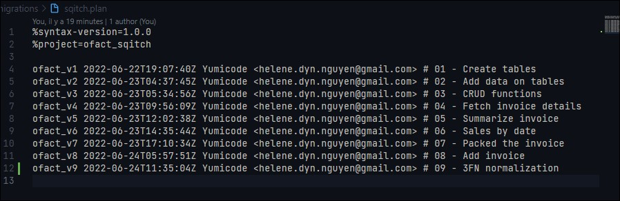

# Création de la base de données

Pour la création de la base de données, je suis partie sur un script qui me permet de créer la base de données en passant par le terminal de commande directement.

Le script se lancera avec bash en passant par [Git Bash](https://www.atlassian.com/fr/git/tutorials/git-bash)


```sh
#~ CREATE SCRIPT
export PGUSER=postgres

#& CREATE USER WITH LOGIN
createuser -l -P ofact
# Reviens à faire : createuser --login --password --pwprompt ocolis
  
#& CREATE DATABASE
createdb -O ofact ofact
# Reviens à faire : createdb --owner=ocolis ocolis

#& INIT Sqitch
sqitch init ofact_sqitch --engine pg

#& CREATE V1
sqitch add ofact_v1 -n "01 - Create tables"
```

Ce script permet de se connecter à la base de données en tant que postgres.

Cela va nous permettre de créer un utilisateur et nous permettre de créer un mot de passe pour s'y connecter.

On va également créer une base de données qui appartiendra à notre utilisateur.

Avec Sqitch, qui est l'outil de versioning pour la base de données, on va initialiser le projet avec 

```sh
sqitch init ofact_sqitch --engine pg
```

On précise quel moteur on va utiliser avec `--engine`

Puis on lance une première version avec le titre associé.

Tout sera bien répertorié dans le fichier sqitch.plan avec nos versions ajoutés

