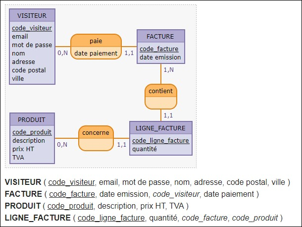

# Gérer la 3e forme normale

Dans le MCD donné, il y avait un problème de normalisation que je n'ai pas géré.

La normalisation est une approche de conception de base de données utilisée dans les bases de données relationnelles pour éviter la redondance.

[Les normalistations expliquées en détail](https://www.ionos.fr/digitalguide/hebergement/aspects-techniques/normalisation-base-de-donnees/)


Le montant TTC n'avait pas lieu d'être dans la table du produit et après correctif, la version a été rajoutée lors du déploiement de la version 9 du projet.

Et si on devait corriger cela, voilà le nouveau MCD.



Pour les correctifs (faite avec @Benjamin Nougadère 😘), on modifie la table d'origine, on lui créée une opération par défaut et on supprime la colonne dont on aura plus besoin.

```sql
BEGIN;


ALTER TABLE product
    ADD COLUMN vat NUMERIC;


UPDATE product SET vat=(price_with_taxes/price - 1.0);


ALTER TABLE product
    DROP COLUMN price_with_taxes,
    ALTER COLUMN vat SET NOT NULL;

COMMIT;

```

Pour la suite, je pars donc avec la colonne price_with_taxes encore présente et c'est surtout le principe de ce qui suit qui va être important.

Retour à l'accueil [HERE](../README.md)