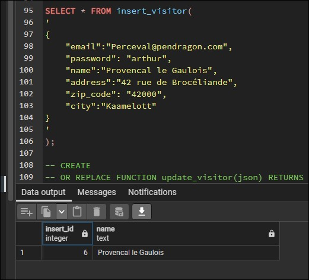
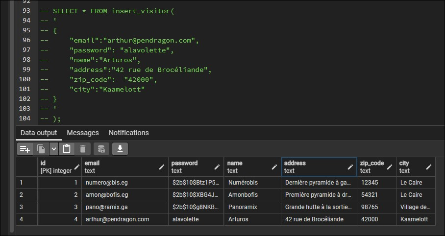
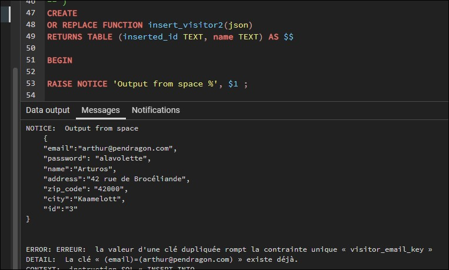
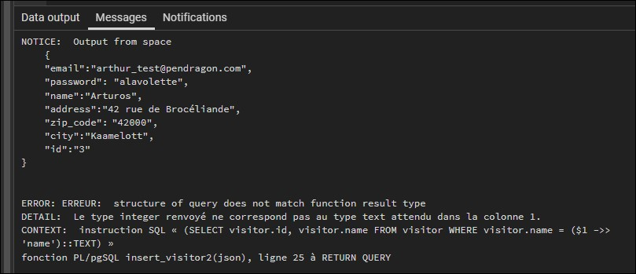

# Création de fonctions CRUD (surtout Create et Update)

Pour les opérations d'insertion et de mise à jour, on va créer des fonctions réutilisables.

Pour l'exemple sur les factures :

## INSERT function

- Créer une fonction commence par

```sql
CREATE OR REPLACE FUNCTION insert_visitor(json)
```

- On donne un nom à la fonction
- On lui définit le type de données qu'on va lui envoyer en paramètre et ici, on veut récupérer du `JSON`, on aurait pu également mettre un nom au paramètre et ici, si on ne met rien, on utilise un token `$1`

```sql
CREATE
OR REPLACE FUNCTION insert_visitor(json) 
RETURNS TABLE (inserted_id INT, name TEXT) AS $$

BEGIN

INSERT INTO
    public.visitor (
        "email",
        "password",
        "name",
        "address",
        "zip_code",
        "city"
    )
VALUES
(
        ($1 ->> 'email')::TEXT,
        ($1 ->> 'password')::TEXT,
        ($1 ->> 'name')::TEXT,
        ($1 ->> 'address')::TEXT,
        ($1 ->> 'zip_code')::POSINT,
        ($1 ->> 'city')::TEXT
);
    RETURN QUERY
        (SELECT visitor.id, visitor.name FROM visitor WHERE visitor.name = ($1 ->> 'name')::TEXT);
    END

$$ LANGUAGE plpgsql VOLATILE; --default value
```

- Ici le `RETURNS TABLE` me permet de générer une nouvelle table pour en ressortir le résultat récupéré par ma requête (requête qui renvoie donc 2 colonnes)

Voilà une idée de résultat renvoyé avec la nouvelle table virtuelle :



Et une insertion complète sur la table `visitor`:



Les problèmes que j'ai pu rencontrer se situent surtout au niveau des types.

Pour pouvoir identifier les erreurs, PostgreSQL nous prévoit la fonction `RAISE NOTICE` qui permet de contrôler ce qu'on récupère :

```sql
RAISE NOTICE 'name_of_output %', value;
```

Le symbole `%` est un paramètre qui sera remplacé par la valeur qu'on aura choisi de faire ressortir :



Ici, `$1` représente bien mon JSON (mais on remarque une erreur car j'ai déjà créé cette entrée avec le même e-mail)

Les erreurs au niveau du type peuvent être notifiée de cette manière :



J'ai créé ici une erreur volontaire sur l'exemple précédent où `inserted_id` est en TEXT alors que cete colonne attend un INTEGER.

Toutes ces erreurs étaient des indices qui m'ont menée à la création de ma fonction telle qu'elle est.

___

# UPDATE function

Pour la mise à jour, l'exemple ci-dessous concerne la facture

```sql
CREATE
OR REPLACE FUNCTION update_invoice(json) 
RETURNS TABLE (updated_id INT) AS $$

BEGIN
UPDATE
    invoice
SET
    "visitor_id" = ($1 ->> 'visitor_id')::INT,
    "paid_at" = COALESCE(($1 ->> 'paid_at')::TIMESTAMPTZ, paid_at)
    -- Source used : https://medium.com/developer-rants/conditional-update-in-postgresql-a27ddb5dd35
WHERE
    invoice."id" = ($1->> 'id')::INT;
    
RETURN QUERY (SELECT invoice.id FROM invoice WHERE invoice.id = ($1->> 'id')::INT);
END

$$ LANGUAGE plpgsql VOLATILE;
```

On voit ici plusieurs choses :

- On veut renvoyer l'id de la facture qui a été mise à jour
- On utilise `COALESCE ()` car cela nous permet de soit conserver la valeur de la date de paiement déjà effectué et si la date de paiement n'a pas encore été rentrée (donc si la valeur est `NULL`), soit de la remplacer par la valeur qu'on aura saisi

Retour à l'accueil [HERE](../README.md)
