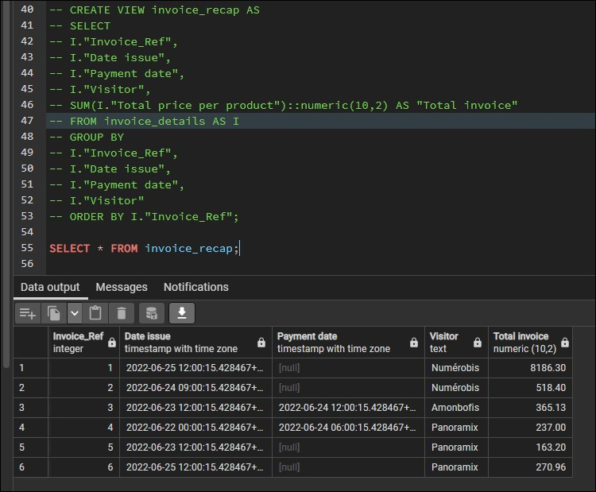

# Utilisation d'une view dans une fonction et *subqueries*

## View dans une fonction

```sql
BEGIN;

--* Use my created view to have expected result
CREATE VIEW invoice_recap AS
SELECT 
I."Invoice_Ref",
I."Date issue",
I."Payment date",
I."Visitor",
SUM(I."Total price per product")::numeric(100,2) AS "Total invoice"
FROM invoice_details AS I
GROUP BY 
I."Invoice_Ref",
I."Date issue",
I."Payment date",
I."Visitor"
ORDER BY I."Invoice_Ref";

-- Search invoice recap :
--SELECT * FROM invoice_recap;

COMMIT;
```

J'ai repris ici une VIEW que j'avais déjà créée pour faire une nouvelle VIEW permettant d'avoir un récapitulatif de la facture.

Ci-dessous l'exemple de ce qui en ressort



Il existe également une autre manière de procéder pour cette création en utilisant les *subqueries* ou encore appelées *requêtes imbriquées* ou *sous-requêtes*

## Requêtes imbriquées

Donc pour utiliser les sous-requêtes, on peut le faire de cette manière :

```sql
* Subqueries version
CREATE VIEW invoice_recap_subqueries AS
SELECT 
    I.id "Invoice_Ref", 
    I.issued_at "Date issue", 
    I.paid_at "Payment date",
 (SELECT "name" 
     FROM "visitor" 
     WHERE "id" = I.visitor_id) "Visitor",
 (SELECT SUM((price_with_taxes) * (SELECT "quantity" FROM "invoice_line" 
                                      WHERE "product_id" = P.id AND invoice_id = I.id))
     FROM product AS P
     -- Source https://www.postgresqltutorial.com/postgresql-tutorial/postgresql-any/
     -- The = ANY is equivalent to IN operator
     WHERE id = ANY (SELECT product_id 
                     FROM invoice_line
                     WHERE invoice_id = I.id) 
 )::NUMERIC(100,2) AS "Total"
FROM invoice AS I;

SELECT * FROM invoice_recap_subqueries;
```

Retour à l'accueil [HERE](../README.md)
