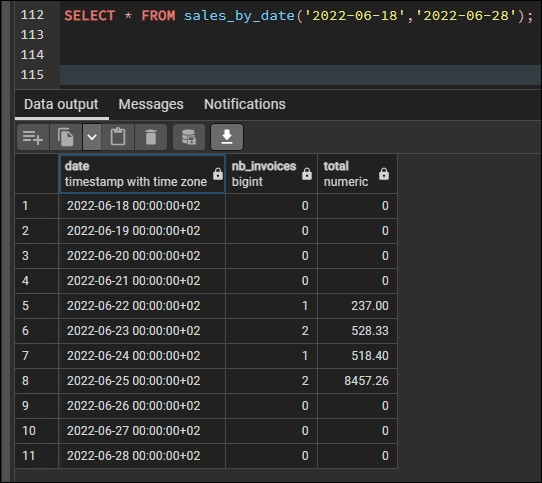
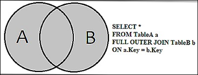

# Fonction avec des paramètres

Pour cette partie, nous souhaitons faire une fonction qui va nous permettre d'indiquer 2 paramètres de dates pour indiquer un intervalle dans lequel on pourra retrouver le total des factures.

On va donc vouloir 3 colonnes et le résultat qui en ressort doit être la suivante :



Dans cette fonction, on voudra compter le nombre de factures à la date en question et le chiffre d'affaires à cette date avec ce nombre de factures

```sql

BEGIN

CREATE TYPE sales AS(
    date TIMESTAMPTZ, 
    nb_invoices BIGINT, 
    total NUMERIC
);

CREATE
OR REPLACE FUNCTION sales_by_date(date1 DATE, date2 DATE) 
RETURNS TABLE (date TIMESTAMPTZ, nb_invoices BIGINT, total NUMERIC) AS $$

BEGIN

RETURN QUERY 
    (SELECT 
    "date_generated", 
    COUNT(invoice_recap."Invoice_Ref") AS nb_invoices, 
    COALESCE(sum(invoice_recap."Total invoice"), 0) AS total 
    FROM generate_series(date1::date, date2::date, '1 day')AS "date_generated"
    FULL JOIN invoice_recap ON ("date_generated" = DATE(invoice_recap."Date issue"))
    GROUP BY "date_generated"
    ORDER BY "date_generated");

END

$$ LANGUAGE plpgsql VOLATILE;

-- Test range of date:
-- SELECT * FROM sales_by_date('2022-06-15','2022-06-23');

COMMIT;
```

On définit un nouveau `TYPE` pour empaqueter de manière personnalisée différents types.

Ici, on utlise une jointure `FULL JOIN` qui va me permettre de récupérer toutes les dates générées grâce à la fonction `generate_series()` ET les dates de facture existantes.

Si aucune facture n'est trouvée, on souhaite retourner 0, je réutilise donc la fonction `COALESCE ( )`



Retour à l'accueil [HERE](../README.md)
