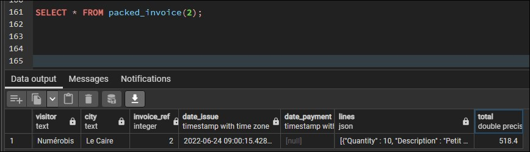

# Utiliser les fonctions de création de JSON PostgreSQL

Pour cette partie, nous souhaitons avoir la facture avec tous les détails en une ligne.

Le résultat doit ressembler à :



Donc la migration aura un nouveau type défini qu'on utilisera pour l'affichage de nos données.

```sql
CREATE TYPE packed AS (
    visitor TEXT, 
    city TEXT, 
    invoice_ref INT,
    date_issue TIMESTAMPTZ,
    date_payment TIMESTAMPTZ, lines JSON, 
    total DOUBLE PRECISION
);

CREATE
OR REPLACE FUNCTION packed_invoice(invoice_id INT) 
RETURNS SETOF packed AS $$

BEGIN

RETURN QUERY
(SELECT
    ID."Visitor",
    ID."City",
    ID."Invoice_Ref",
    ID."Date issue",
    ID."Payment date",
    JSON_AGG( json_build_object(
       'Quantity',ID."Quantity",
        'Description',ID."Description",
        'Price',ID."Price",
        'VAT',ID."VAT",
        'Total',ID."Total price per product")) AS lines,
    SUM(ID."Total price per product") AS "Total"
FROM invoice_details AS ID
WHERE ID."Invoice_Ref" = invoice_id
GROUP BY 
    ID."Visitor",
    ID."City", 
    ID."Invoice_Ref",
    ID."Date issue",
    ID."Payment date");

END

$$ LANGUAGE plpgsql VOLATILE;
```
On remarquera pour cette fonction l'utilisation d'une fonction d'aggrégation JSON pour construire un objet JSON avec `json_build_object` qu'on voudra insérer sur une ligne grâce à `JSON_AGG`.

Retour à l'accueil [HERE](../README.md)