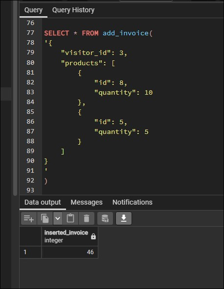

# Utiliser les fonctions avec une boucle

Pour cette partie, nous souhaitons ajouter une facture à notre base de données et pour cela, on souhaite pouvoir insérer plusieurs produits à cette facture.

Les tests ont été fait avec les valeurs suivantes :

```sql
SELECT * FROM add_invoice(
'{
    "visitor_id": 3,
    "products": [
        {
            "id": 8,
            "quantity": 10
        },
        {
            "id": 5,
            "quantity": 5
        }
    ]
}
'
)
```

On voit différentes informations dans les valeurs que nous souhaitons rentrer :

- On souhaite ajouter une facture pour un visiteur en particulier
- On souhaite ajouter plusieurs produits

Pour la fonction que je voulais créer, je souhaitais ajouter le tout en une fois et donc gérer le tableau de produits insérés.

Je suis donc partie sur une boucle qui fera appel à ma fonction d'insertion de lignes créer.

```sql
CREATE
OR REPLACE FUNCTION add_invoice(JSON) 
RETURNS TABLE (inserted_invoice INT) AS $$

DECLARE
_elem JSON;
_array JSON := ($1 ->> 'products');

BEGIN

PERFORM (SELECT insert_invoice."inserted_id" FROM insert_invoice($1));

FOR _elem IN SELECT * FROM json_array_elements(_array)
LOOP
-- As logger to check value
--     RAISE NOTICE 'Output from Gondor %', _elem ->> 'id';
--     RAISE NOTICE 'Output from Gondor %', _elem ->> 'quantity';
--     RAISE NOTICE 'Output from Gondor %', (json(_array));
--     RAISE NOTICE 'Output from Gondor %', (SELECT invoice.id
--      FROM invoice WHERE invoice.visitor_id = ($1 ->> 'visitor_id')::INT
--      ORDER BY invoice.id DESC LIMIT 1) ;
--     RAISE NOTICE 'Output from Gondor %', (SELECT json_build_object
--                                          ('quantity',((_elem ->> 'quantity')::INT), 
--                                           'invoice_id',(SELECT invoice.id FROM invoice 
--                                                         WHERE invoice.visitor_id = ($1 ->> 'visitor_id')::INT
--                                                         ORDER BY invoice.id DESC LIMIT 1),
--                                          'product_id', ((_elem ->> 'id')::INT)));

    -- Source https://stackoverflow.com/questions/1953326/how-to-call-a-function-postgresql
    -- If you want to discard the result of SELECT, use PERFORM
    PERFORM (SELECT I.inserted_invoice 
             FROM insert_invoice_line AS I (
    -- Source build object
    -- https://www.postgresql.org/docs/9.6/functions-json.html  
                (SELECT json_build_object
                        ('quantity',((_elem ->> 'quantity')::INT), 
                        'invoice_id',(SELECT invoice.id FROM invoice 
                                    ORDER BY invoice.id DESC LIMIT 1),
                        'product_id', ((_elem ->> 'id')::INT)))));
END LOOP;
    
    RETURN QUERY ((SELECT invoice.id FROM invoice ORDER BY invoice.id DESC LIMIT 1));
     
END

$$ LANGUAGE plpgsql VOLATILE;

```

J'ai laissé ici volontairement les `RAISE NOTICE` pour voir les contrôles effectués pour arriver jusqu'à avoir le résultat voulu.

`PERFORM` permet de lancer et effectuer la requête sans avoir de valeurs de retour attendu.

Pour la boucle, la structure simplifiée est la suivante :

```sql
DECLARE
_elem JSON;
_array JSON := ($1 ->> 'products');

FOR _elem IN SELECT * FROM json_array_elements(_array)
LOOP

    [statements]

END LOOP;

```

On déclare les éléments en premier lieu, ensuite on crée la boucle et à l'intérieur ce que l'on souhaite répéter.

Dans ma fonction, je récupère mon tableau d'éléments pour boucler dessus.

Et je retourne une seule et unique valeur qui est l'identification de la facture qui a été ajoutée !



Retour à l'accueil [HERE](../README.md)
